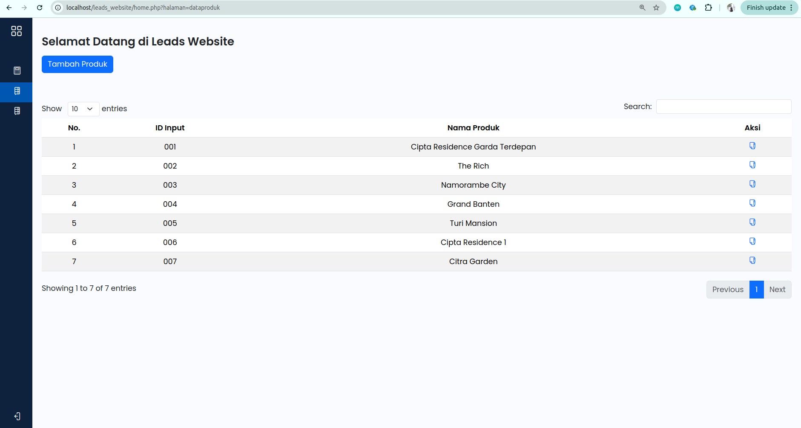

# How to use this repository:
- Install XAMPP and run MySQL and Apache Server
- Create database with the name is 'db_leads'
- Open localhost/phpmyadmin/
- Point to db_leads and copy paste the query from connection/db_leads.sql to create and insert the data
- Make a folder named 'leads_website' inside C://xampp/htdocs/ folder if you use Windows (/opt/lampp/htdocs/ folder in Ubuntu)
- Put all the project files to that folder
- Open your browser and type in localhost/leads_website/index.php and the page will ask you to input email (type in: adminUnitedTractor@gmail.com) and password (type in: adminUnitedTractor123 (it has to be persisted because the password is saved in SHA256 format))

# Feature of Leads Website
- Login and Logout
- Leads Menu:
    - Show all leads with dataTables (pagination and search included)
    - Update and delete a specific lead
    - Add new lead
- Products Menu:
    - Show all products with dataTables (pagination and search included)
    - Update a specific product
    - Add new product
- Sales Menu:
    - Show all sales with dataTables (pagination and search included)
    - Update a specific sale
    - Add new sale

# Preview of Leads Website

    
Login

     
    

    
Leads

    

        
- Leads Data

         
        
    

    

        
Update A Lead

         
        
    

    

        
Add New Lead

         
        
    

    
Products

    

        
Products Data

         
        
    

    

        
Update A Product

         
        
    

    

        
Add New Product

         
        
    

    
Sales

    

        
Sales Data

         
        
    

    

        
Update Sales

         
        
    

    

        
Add New Sales

         
        
    

